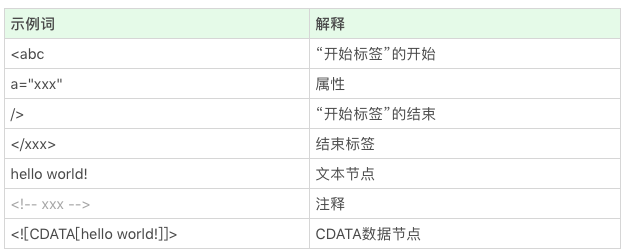

# 锻炼

每组开合跳 30s、深蹲 30s、弓箭步 30s、提膝下压 30s，中途休息一分钟左右，做 6 组。

# 学习 重学前端

## 第 11 讲：浏览器：一个浏览器是如何工作的（阶段二）

### 如何解析请求回来的 HTML 代码，DOM 树又是如何构建的。

#### 解析代码

HTML 的结构不算太复杂，我们日常开发需要的 90%的“词”（指编译原理的术语 token，表示最小的有意义的单元），种类大约只有标签开始、属性、标签结束、注释、CDATA 节点几种。

##### 1.词（token）是如何被拆分的

##### 2.状态机

状态机的初始状态，我们仅仅区分 “< ”和 “非<”：

1、如果获得的是一个非<字符，那么可以认为进入了一个文本节点；  
2、如果获得的是一个<字符，那么进入一个标签状态。

当我们在标签状态时，则会面临着一些可能性。

1、比如下一个字符是“ ! ” ，那么很可能是进入了注释节点或者 CDATA 节点。  
2、如果下一个字符是 “/ ”，那么可以确定进入了一个结束标签。  
3、如果下一个字符是字母，那么可以确定进入了一个开始标签。  
4、如果我们要完整处理各种 HTML 标准中定义的东西，那么还要考虑“ ? ”“% ”等内容。

代码实现，在 C/C++和 JavaScript 中，实现状态机的方式大同小异：我们把每个函数当做一个状态，参数是接受的字符，返回值是下一个状态函数。（状态机真的是一种没有办法封装的东西，所以我们永远不要试图封装状态机。）

### 构建 DOM 树（没看懂）

<video id="video" controls="" preload="none" src="../image/DOM.mp4">
</video>
