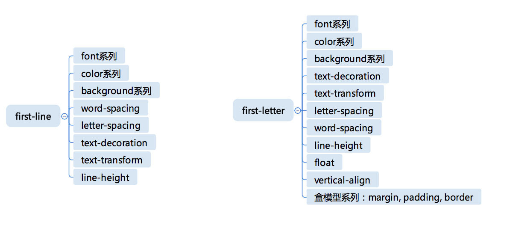

# 学习 重学前端

## 第 21 讲：CSS 选择器：伪元素是怎么回事儿

### 选择器的组合

选择器列表是用逗号分隔的复杂选择器序列；  
复杂选择器则是用空格、大于号、波浪线等符号连接的复合选择器；  
复合选择器则是连写的简单选择器组合。

#### 第一优先级:无连接符号

#### 第二优先级:空格、~、+、>、||

“空格”：后代，表示选中所有符合条件的后代节点， 例如“ .a .b ”表示选中所有具有 class 为 a 的后代节点中 class 为 b 的节点。

“>” ：子代，表示选中符合条件的子节点，例如“ .a>.b ”表示：选中所有“具有 class 为 a 的子节点中，class 为 b 的节点”。

“~” : 后继，表示选中所有符合条件的后继节点，后继节点即跟当前节点具有同一个父元素，并出现在它之后的节点，例如“ .a~.b ”表示选中所有具有 class 为 a 的后继中，class 为 b 的节点。

“+”：直接后继，表示选中符合条件的直接后继节点，直接后继节点即 nextSlibling。例如 “.a+.b ”表示选中所有具有 class 为 a 的下一个 class 为 b 的节点。

“||”：列选择器，表示选中对应列中符合条件的单元格。

#### 第三优先级：逗号

逗号表示“或”的关系，实际上，可以把它理解为“两条内容一样的 CSS 规则”的一种简写。

同一优先级的选择器遵循“后面的覆盖前面的”原则。

### 伪元素

::first-line 和 ::first-letter 是比较类似的伪元素，其中一个表示元素的第一行，一个表示元素的第一个字母。

::before 表示在元素内容之前插入一个虚拟的元素，::after 则表示在元素内容之后插入。 必须指定 content 属性才会生效 .

## 第 22 讲：| 浏览器 DOM：你知道 HTML 的节点有哪几种吗？

### DOM API

节点：DOM 树形结构中的节点相关 API。

事件：触发和监听事件相关 API。

Range：操作文字范围相关 API。

遍历：遍历 DOM 需要的 API。

#### 节点

DOM 的树形结构所有的节点有统一的接口 Node：

##### Node

parentNode：返回一个当前结点 Node 的父节点。

childNodes：返回一个包含了该节点所有子节点的实时的 NodeList。

firstChild：返回该节点的第一个子节点 Node，如果该节点没有子节点则返回 null。

lastChild：返回该节点的最后一个子节点 Node，如果该节点没有子节点则返回 null。

nextSibling：返回与该节点同级的下一个节点 Node，如果没有返回 null。

previousSibling：返回一个当前节点同辈的前一个结点( Node) ，或者返回 null。

#### 查找元素

querySelector：返回文档中匹配指定 CSS 选择器的一个元素

querySelectorAll:返回文档中匹配指定 CSS 选择器的所有元素，返回 NodeList 对象。

getElementById:可返回对拥有指定 ID 的第一个对象的引用。

getElementsByName:返回带有指定名称的对象的集合。

getElementsByTagName:返回带有指定标签名的对象的集合。

getElementsByClassName：返回文档中所有指定类名的元素集合，作为 NodeList 对象。
