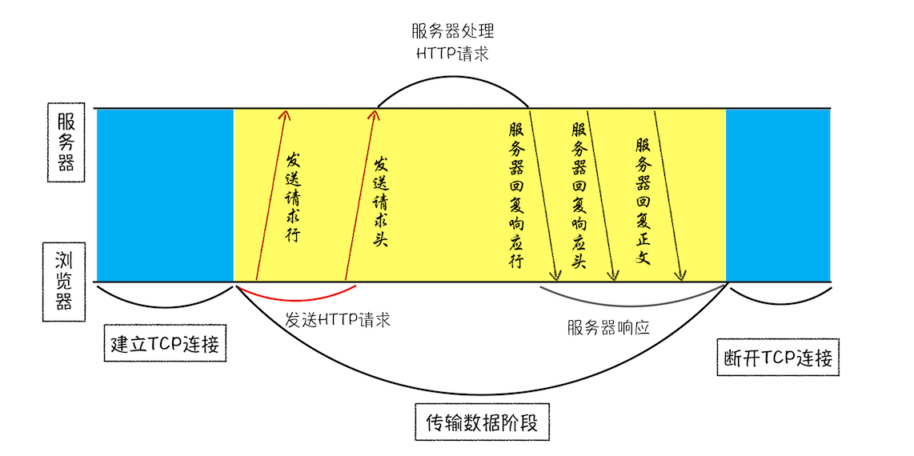

# 锻炼

早上：每组开合跳 30s、深蹲 30s、弓箭步 30s、提膝下压 30s，中途休息一分钟左右，做 6 组。

# 学习 浏览器工作原理与实践

## 03 | HTTP 请求流程：为什么很多站点第二次打开速度会很快？

主要原因是第一次加载页面过程中，缓存了一些的数据。

HTTP 请求流程示意图：

### 浏览器端发起 HTTP 请求流程

1. 构建请求

2. 查找缓存

   在真正发起网络请求之前，浏览器会先在浏览器缓存中查询是否有要请求的文件。

   浏览器缓存是一种在本地保存资源副本，以供下次请求时直接使用的技术。

   好处：缓解服务器端压力，提升性能（获取资源的耗时更短了）、快速资源加载.

3. 准备 IP 地址和端口

   HTTP 和 TCP 关系： HTTP 工作开始之前，浏览器需要通过 TCP 与服务器建立连接，HTTP 的内容是通过 TCP 的传输数据阶段来实现的。

   HTTP 和 TCP 关系图：

   

   第一步浏览器会请求 DNS 返回域名对应的 IP,接下来就需要获取端口号, URL 没有特别指明端口号，那么 HTTP 协议默认是 80 端口.

4. 等待 TCP 队列

   同一个域名同时最多只能建立 6 个 TCP 连接，如果在同一个域名下同时有 10 个请求发生，那么其中 4 个请求会进入排队等待状态，直至进行中的请求完成。

   如果当前请求数量少于 6，会直接进入下一步，建立 TCP 连接。

5. 建立 TCP 连接

6. 发送 HTTP 请求

   HTTP 请求数据格式:

   

### 服务器端处理 HTTP 请求流程

1.  返回请求

    服务器响应的数据格式:

    

2.  断开连接

    服务器向客户端返回了请求数据，它就要关闭 TCP 连接。

    浏览器或者服务器在其头信息中加入了”Connection:Keep-Alive“，那么 TCP 连接在发送后将仍然保持打开状态，这样浏览器就可以继续通过同一个 TCP 连接发送请求。

# 学习 重学前端

## 第 29 讲：JavaScript 语法（二）：你知道哪些 JavaScript 语句？

普通语句：

声明型语句：

