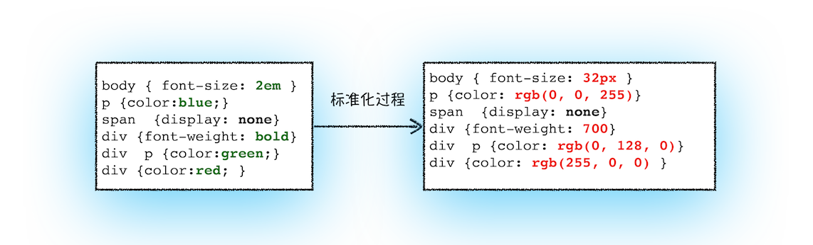

# 锻炼

早上：每组开合跳 30s、深蹲 30s、弓箭步 30s、提膝下压 30s，做 5 组。

# 学习 浏览器工作原理与实践

## 05\06 | 渲染流程 ：HTML、CSS 和 JavaScript，是如何变成页面的？

按照渲染的时间顺序，可以分为：构建 DOM 树、样式计算、布局阶段、分层、绘制、分块、光栅化和合成。

### 构建 DOM 树

DOM 树构建过程示意图:

### 样式计算（Recalculate Style）

1. 把 CSS 转换为浏览器能够理解的结构

   CSS 文本转换为浏览器可以理解的结构——styleSheets。

2. 转换样式表中的属性值，使其标准化

   将所有值转换为渲染引擎容易理解的、标准化的计算值。例：

   

3. 计算出 DOM 树中每个节点的具体样式

### 布局阶段

1. 创建布局树

   布局树构造过程示意图：

   

2. 布局计算

### 分层 (元素间有层叠就需要分层)

1. 拥有层叠上下文属性的元素会被提升为单独的一层;

2. 需要剪裁（clip）的地方也会被创建为图层;

### 图层绘制

渲染引擎实现图层的绘制与之类似，会把一个图层的绘制拆分成很多小的绘制指令，然后再把这些指令按照顺序组成一个待绘制列表：

### 栅格化（raster）

将图块转换为位图。

### 合成和显示

### 完整的渲染流水线示意图

### 完整的渲染流程

1. 渲染进程将 HTML 转换为 DOM 树结构。
2. 渲染引擎将 CSS 样式表转化为 styleSheets，计算出 DOM 节点的样式。
3. 创建布局树，并计算元素的布局信息。
4. 对布局树进行分层，并生成分层树。
5. 为每个图层生成绘制列表，并将其提交到合成线程。
6. 合成线程将图层分成图块，并在光栅化线程池中将图块转换成位图。
7. 合成线程发送绘制图块命令（DrawQuad）给浏览器进程。
8. 浏览器进程根据 DrawQuad 消息生成页面，并显示到显示器上。
