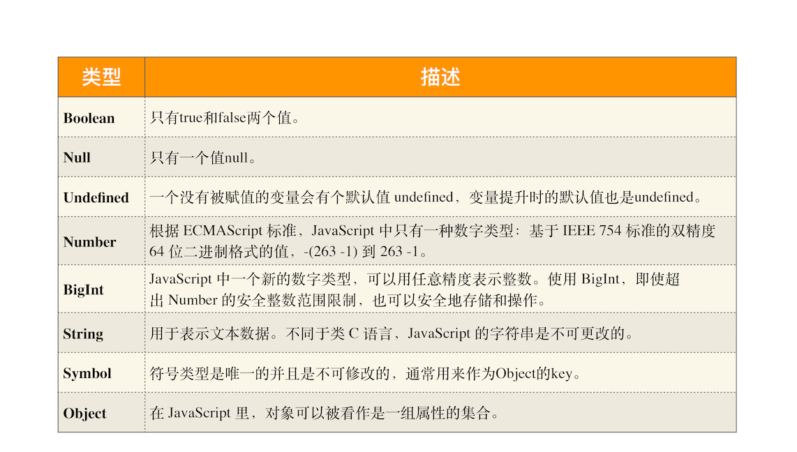

# 学习 浏览器工作原理与实践

## 12 | 栈空间和堆空间：数据是如何存储的？

堆：队列优先,先进先出；由操作系统自动分配释放 ，存放函数的参数值，局部变量的值等。其操作方式类似于数据结构中的栈。

栈：先进后出；动态分配的空间 一般由程序员分配释放， 若程序员不释放，程序结束时可能由 OS 回收，分配方式倒是类似于链表。

JavaScript 数据类型一种有 8 种：

前面的 7 种数据类型称为原始类型，把最后一个对象类型称为引用类型

JavaScript 的执行过程中有三种类型内存空间：代码空间、栈空间和堆空间。

### 栈空间和堆空间

栈空间就是调用栈，是用来存储执行上下文的。

原始类型的数据值都是直接保存在“栈”中的，引用类型的值是存放在“堆”中的。

栈空间不会设置太大，主要用来存放一些原始类型的小数据。

堆空间很大，能存放很多大的数据，缺点是分配内存和回收内存都会占用一定的时间。

原始类型的数据是存放在栈中，引用类型的数据是存放在堆中的。
