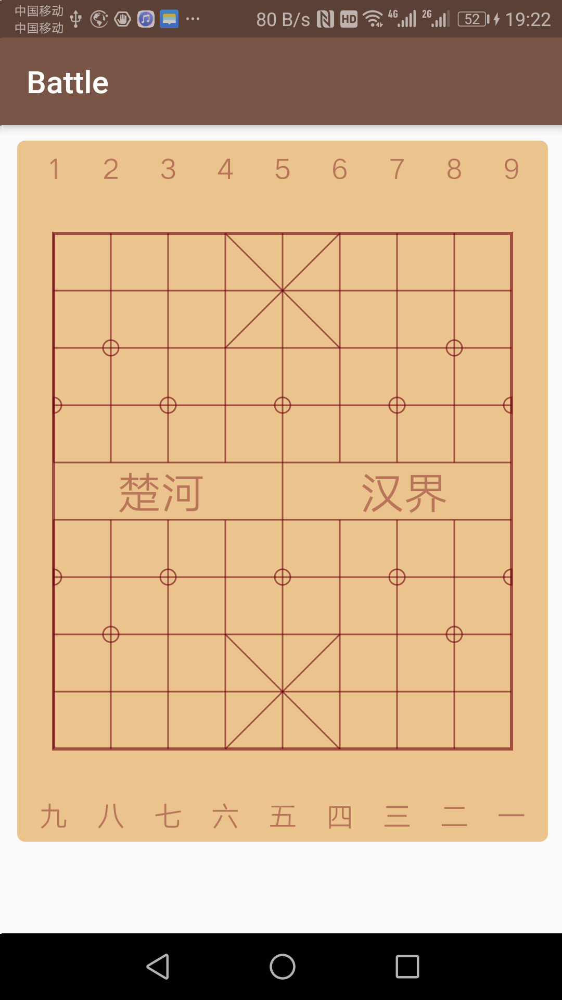

# 锻炼

每组开合跳 30s、深蹲 30s、弓箭步 30s、提膝下压 30s，中途休息一分钟左右，做 6 组。

# 学习 Dart 入门实践

## 初探 Dart 语法 02

### 1. 运算符

#### 1.1 算术运算符

+（加）、-（减）、\*（乘）、/（除）、~/（取整）、%（取余）

#### 1.2 条件运算符

> 、<、==、!=、>=、<=

#### 1.3 逻辑运算符

||、&&、!

#### 1.4 位运算符

&（位与）、|（位或）、~（位非）、^（异或）、<<（左移）、>>（右移）

#### 1.5 三目运算符

condition ? expr1 : expr2

例：

```javascript
var isOpened = value == 1 ? true : false;
```

#### 1.6 空安全运算符

```javascript
result = expr1 ?? expr2; //若 expr1 为 null，返回 expr2 的值，否则返回 expr1 的值
expr1 ??= expr2; //若 expr1 为 null，则把 expr2 的值赋值给 expr1
result = expr1?.value; //若 expr1 为 null，就返回 null，否则就返回 expr1.value 的值
```

#### 1.7 级联操作符（..）

级联操作符是 ..，可以让你对一个对象中字段进行链式调用操作。

```javascript
question
    ..id = '10001'
    ..stem = '第一题: xxxxxx'
    ..choices = <String> ['A','B','C','D']
    ..hint = '听音频做题';
```

#### 1.8 运算符重载（没看懂）

### 2. 异常

try-catch-finally，捕获异常

Dart 中的常见异常有：NoSuchMethodError（当在一个对象上调用一个该对象没有 实现的函数会抛出该错误）、ArgumentError（调用函数的参数不合法会抛出这个错误）。

```javascript
main() {
  int num = 18;
  int result = 0;
  try {
    result = num ~/ 0;
  } catch (e) {//捕获到 IntegerDivisionByZeroException
    print(e.toString());
  } finally {
    print('$result');
  }
}
```

### 3. 函数

#### 3.1 函数的基本用法

```javascript
main() {
    print('sum is ${sum(2, 5)}');
}

num sum(num a, num b) {
    return a + b;
}
```

#### 3.2 函数参数列表传参规则

```javascript
//num a, num b, num c, num d 最普通的传参：调用时，参数个数和参数顺序必须固定
add1(num a, num b, num c, num d) {
  print(a + b + c + d);
}

//[num a, num b, num c, num d]传参：调用时，参数个数不固定，但是参数顺序需要一一对应，不支持命名参数
add2([num a, num b, num c, num d]) {
  print(a + b + c + d);
}

//{num a, num b, num c, num d}传参：调用时，参数个数不固定，参数顺序也可以不固定，支持命名参数，也叫可选参数，是 Dart 中的一大特性，这就是为啥 Flutter 代码那么多可选属性，大量使用可选参数
add3({num a, num b, num c, num d}) {
  print(a + b + c + d);
}

//num a, num b, {num c, num d}传参：调用时，a、b 参数个数固定顺序固定，c、d 参数个数和顺序也可以不固定
add4(num a, num b, {num c, num d}) {
  print(a + b + c + d);
}
```

#### 3.3 函数默认参数和可选参数

```javascript
add3({num a, num b, num c, num d = 100}) {//d 就是默认值参数，给的默认值是 100
   print(a + b + c + d);
}

main() {
    add3(b: 200, a: 100, c: 800);
}
```

#### 3.4 函数类型与高阶函数

```javascript
main() {
  Function square = (a) {
    return a * a;
  };

  Function square2 = (a) {
    return a * a * a;
  };

  add(3, 4, square, square2)
}

num add(num a, num b, [Function op, Function op2]) {
  //函数作为参数传递
  return op(a) + op2(b);
}
```

#### 3.5 函数的简化以及箭头函数

```javascript
add4(num a, num b, {num c, num d}) {
  print(a + b + c + d);
}

add5(num a, num b, {num c, num d})  =>  print(a + b + c + d);
```

### 4. 面向对象

Dart 中一切皆是对象

# 实战 Flutter 象棋从零到上架

绘制棋盘完成：


