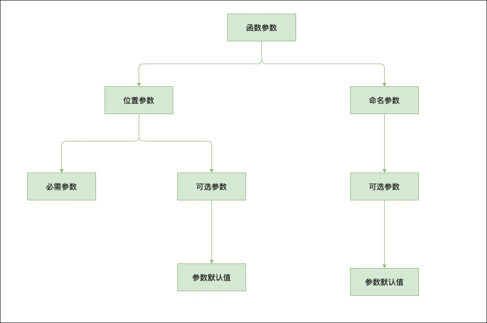
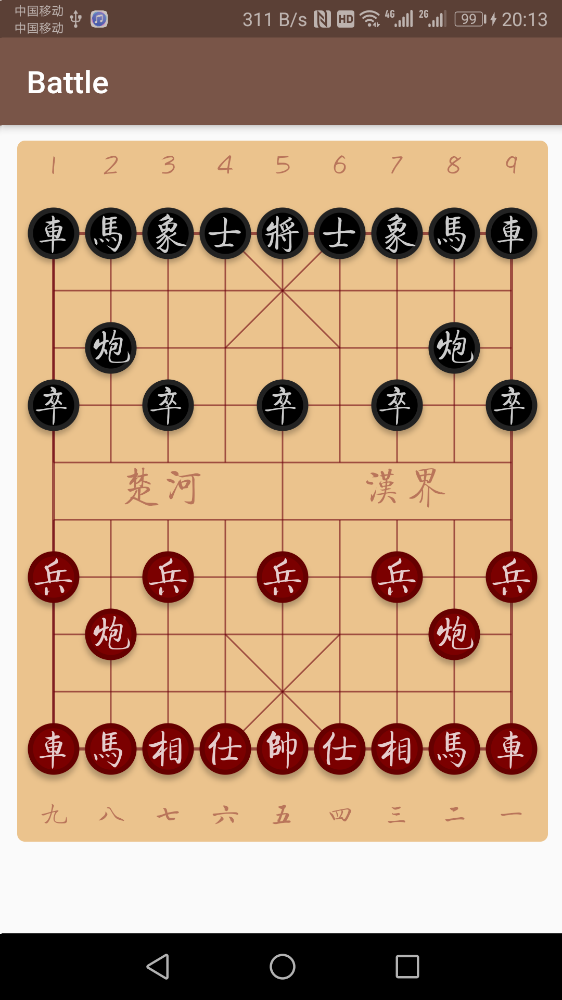

# 锻炼

每组开合跳 30s、深蹲 30s、弓箭步 30s、提膝下压 30s，中途休息一分钟左右，做 6 组。

# 学习 Dart 入门实践

## 掌握如何让函数更好地调用

### 1. 函数参数

Dart 中函数参数大致可分为两种：位置参数和命名参数:



位置参数和命名参数混用：

```javascript
//注意: 可选命名参数必须在必需位置参数的后面
num add(num a, num b, {num c, num d}) {
   return a + b + c + d;
}
//调用
main() {
   print(add(4, 5, d: 3, c: 1));//这里的命名参数就是可以任意顺序指定参数名传值,例如 d: 3, c: 1，但是必需参数必须按照顺序传参。
}
```

### 2. 匿名函数

没有函数名称的函数，这种函数称为“匿名函数”

```javascript
(num x) => x;//没有函数名，有必需的位置参数 x
(num x) {return x;}//等价于上面形式
(int x, [int step]) => x + step;//没有函数名，有可选的位置参数 step
(int x, {int step1, int step2}) => x + step1 + step2;////没有函数名，有可选的命名参数 step1、step2
```

### 3. 箭头函数

```javascript
main() {
  List<int> numbers = [3, 1, 2, 7, 12, 2, 4];
  print(numbers.reduce((prev, curr) {//闭包简写形式
        return prev + curr;
  }));
  print(numbers.reduce((prev, curr) => prev + curr)); //等价于上述形式，箭头函数简写形式
}
```

### 4. 局部函数

函数内定义的函数

### 5. 顶层函数和静态函数

```javascript

//顶层函数，不定义在类的内部
main() {
  print('hello dart');
}

class Number {
    static int getValue() => 100;//static 修饰定义在类的内部。
}
```

# 实战 Flutter 象棋从零到上架

绘制棋子完成：


