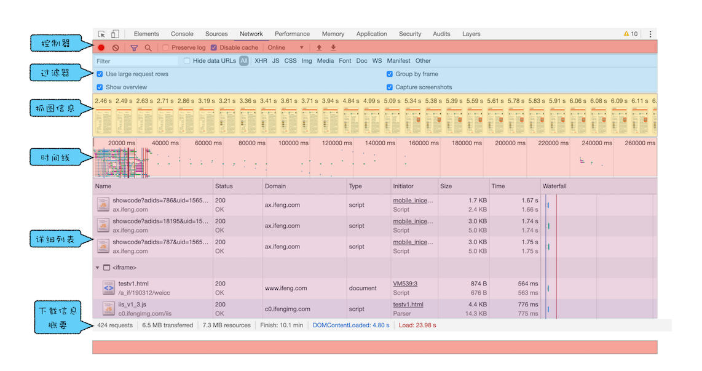

# 学习 浏览器工作原理与实践

## 21 | Chrome 开发者工具：利用网络面板做性能分析

### 网络面板

#### 控制器

#### 过滤器

通过过滤器模块来筛选你想要的文件类型。

#### 抓图信息

用来分析用户等待页面加载时间内所看到的内容，分析用户实际的体验情况。

#### 时间线

用来展示 HTTP、HTTPS、WebSocket 加载的状态和时间的一个关系，用于直观感受页面的加载过程。如果是多条竖线堆叠在一起，说明这些资源被同时被加载。至于具体到每个文件的加载信息，还需要用到下面要讲的详细列表。

#### 详细列表

详细记录了每个资源从发起请求到完成请求这中间所有过程的状态，以及最终请求完成的数据信息。

1. 列表的属性， 包含 Name、Status、Type、Initiator 等。
2. 详细信息，查看响应行、响应头、响应体和资源的时间线等信息。

#### 下载信息概要

查看所有资源加载花费的时间。

浏览器会为每个域名最多维护 6 个 TCP 连接，如果发起一个 HTTP 请求时，这 6 个 TCP 连接都处于忙碌状态，那么这个请求就会处于排队状态。

### 优化时间线上耗时项

1. 排队（Queuing）时间过久
   原因：是由浏览器为每个域名最多维护 6 个连接导致的。

   优化方法：

   让 1 个站点下面的资源放在多个域名下面，比如放到 3 个域名下面，这样就可以同时支持 18 个连接了，这种方案称为域名分片技术；

   把站点升级到 HTTP2， HTTP2 已经没有每个域名最多维护 6 个 TCP 连接的限制。

2. 第一字节时间（TTFB）时间过久

   原因：服务器生成页面数据的时间过久、网络的原因、发送请求头时带上了多余的用户信息（如一些不必要的 Cookie 信息）

   优化方法：

   高服务器的处理速度、使用 CDN 来缓存一些静态文件、尽可能地减少一些不必要的 Cookie 数据信息。

3. Content Download 时间过久

   有可能是字节数太多的原因导致的。解决方法：减少文件大小，比如压缩、去掉源码中不必要的注释等方法。

## 22 | DOM 树：JavaScript 是如何影响 DOM 树构建的？

### 什么是 DOM

表述 HTML 的内部数据结构，它会将 Web 页面和 JavaScript 脚本连接起来，并过滤一些不安全的内容。

### DOM 树如何生成

在渲染引擎内部，有一个 HTML 解析器（HTMLParser）的模块，它就是负责将 HTML 字节流转换为 DOM 结构。

1. 第一个阶段，通过分词器将字节流转换为 Token。
2. 将 Token 解析为 DOM 节点，并将 DOM 节点添加到 DOM 树中。

### JavaScript 是如何影响 DOM 生成的

遇到 JS 文件，页面会停止 DOM 解析，等 js 执行完成后再解析 DOM.
