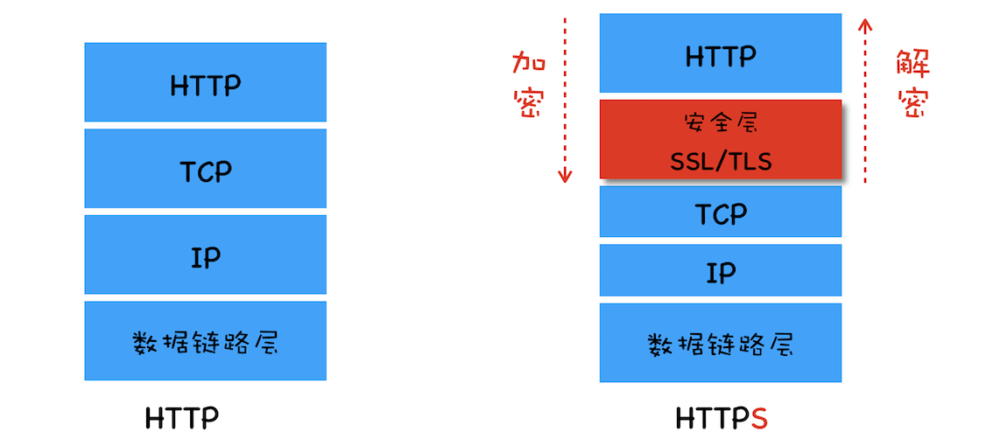

## 36 | HTTPS：让数据传输更安全

HTTP VS HTTPS

安全层有两个主要的职责：对发起 HTTP 请求的数据进行加密操作和对接收到 HTTP 的内容进行解密操作。

### HTTPS 第一版：使用对称加密

对称加密是指加密和解密都使用的是相同的密钥

使用对称加密实现 HTTPS

1. 浏览器发送它所支持的加密套件列表和一个随机数 client-random，这里的加密套件是指加密的方法，加密套件列表就是指浏览器能支持多少种加密方法列表。
2. 服务器会从加密套件列表中选取一个加密套件，然后还会生成一个随机数 service-random，并将 service-random 和加密套件列表返回给浏览器。
3. 最后浏览器和服务器分别返回确认消息。

### HTTPS 第二版：使用非对称加密

非对称加密算法有 A、B 两把密钥，如果你用 A 密钥来加密，那么只能使用 B 密钥来解密；反过来，如果你要 B 密钥来加密，那么只能用 A 密钥来解密。

非对称加密实现 HTTPS:

1. 首先浏览器还是发送加密套件列表给服务器。
2. 然后服务器会选择一个加密套件，不过和对称加密不同的是，使用非对称加密时服务器上需要有用于浏览器加密的公钥和服务器解密 HTTP 数据的私钥，由于公钥是给浏览器加密使用的，因此服务器会将加密套件和公钥一道发送给浏览器。
3. 最后就是浏览器和服务器返回确认消息。

#### 存在问题

1. 非对称加密的效率太低。这会严重影响到加解密数据的速度，进而影响到用户打开页面的速度。
2. 无法保证服务器发送给浏览器的数据安全。虽然浏览器端可以使用公钥来加密，但是服务器端只能采用私钥来加密，私钥加密只有公钥能解密，但黑客也是可以获取得到公钥的，这样就不能保证服务器端数据的安全了。

### HTTPS 第三版：对称加密和非对称加密搭配使用

在传输数据阶段依然使用对称加密，但是对称加密的密钥我们采用非对称加密来传输。

混合加密实现 HTTPS：

1. 首先浏览器向服务器发送对称加密套件列表、非对称加密套件列表和随机数 client-random；
2. 服务器保存随机数 client-random，选择对称加密和非对称加密的套件，然后生成随机数 service-random，向浏览器发送选择的加密套件、service-random 和公钥；
3. 浏览器保存公钥，并利用 client-random 和 service-random 计算出来 pre-master，然后利用公钥对 pre-master 加密，并向服务器发送加密后的数据；
4. 最后服务器拿出自己的私钥，解密出 pre-master 数据，并返回确认消息。

pre-master 是经过公钥加密之后传输的，黑客无法获取到 pre-master，黑客就无法生成密钥，就保证了黑客无法破解传输过程中的数据了。

问题：这种方式依然存在着问题，比如打开极客时间的官网，但是黑客通过 DNS 劫持将极客时间官网的 IP 地址替换成了黑客的 IP 地址，我访问的其实是黑客的服务器了，黑客就可以在自己的服务器上实现公钥和私钥，而对浏览器来说，它完全不知道现在访问的是个黑客的站点。

### 第四版：添加数字证书

数字证书有两个作用：一个是通过数字证书向浏览器证明服务器的身份，另一个是数字证书里面包含了服务器公钥。

完整的 HTTPS 请求流程：

与第三版的 HTTPS 协议相比，这里主要有两点改变：

1. 服务器没有直接返回公钥给浏览器，而是返回了数字证书，而公钥正是包含在数字证书中的；
2. 在浏览器端多了一个证书验证的操作，验证了证书之后，才继续后续流程。
