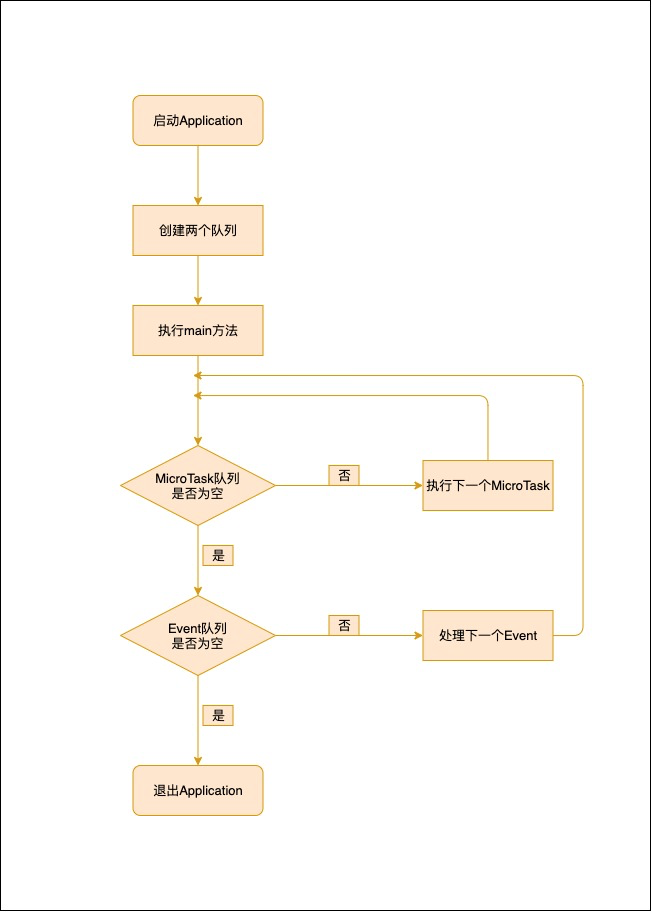

# 学习 Dart 入门实践

## 异步编程之 EventLoop

Dart 和 JavaScript 一样都是单线程模型.

### 1. 梳理几个概念

#### 1.1 同步（Synchronous）和异步（Asynchronous）

同步：存在依赖顺序关系的操作之间是同步的，比如说 B 操作是依赖 A 操作的返回，B 操作的执行必须要等到 A 操作执行之后才能执行。

异步：操作之间并没有依赖关系的，操作执行的顺序并没有一定严格。比如操作 A、B、C 并没有依赖联系，哪个先开始执行，先执行结束都没有关系。

#### 1.2 阻塞和非阻塞

阻塞和非阻塞更侧重于描述操作程序是否会立即返回.

同步不一定会阻塞，主要取决于在同步执行的操作中是否存在有阻塞的操作，而基于单线程的异步 API 实现里的操作，一般都会要求为非阻塞。

### 1.3 多线程和单线程

单线程和多线程主要侧重的是运行的环境。多线程既可以实现同步也能实现异步，单线程也是既可以实现同步，也可以实现异步。

### 2. Dart 中的 EventLoop（事件循环）

Dart 是支持单线程非阻塞式异步，支持是因为 Dart 的事件循环（EventLoop）的驱动。

### 3. EventLoop 的组成

事件队列（Event Queue）和 微任务队列（MicroTask Queue）。

#### 3.1 事件队列（Event Queue）

主要包含一些外部事件和 Future(执行耗时操作，表示在未来会返回某个值，并可以使用 then（）方法和 catchError（）来注册 callback 来监听 Future 的处理结果)，如 IO、绘制、手势以及 Timer 等事件。

每次触发外部事件时，需要执行的相应的代码就会被引用到事件队列中。如果没有任何微任务执行的话，EventLoop 会取出事件队列中的第一个事件然后执行它。 Future 也是通过事件队列进行处理的，在 Dart 一次网络请求触发返回包装的 Future，最后是否拿到正常数据或异常这个事件最终也是交由事件队列来处理的。

#### 3.2 微任务队列（MicroTask Queue）

用于 Dart 内部的微任务（内部非常短暂操作），一般是通过 scheduleMicroTask 方法实现调度，这些任务需要在其他内部微任务执行完之后，且在把事件移交给事件队列之前立即异步执行。

```dart
import 'dart:async';

void main() {
  release();
}

void release() {
  scheduleMicrotask(_dispose);//在资源关闭后执行 dispose 操作
  _close();//关闭资源
}

void _close() {
  print('close resource');
}

void _dispose() {
  print('dispose run');
}
//结果
close resource
dispose run

```

### 4. EventLoop 的执行流程

当启动一个 Dart 应用程序或者 Flutter 应用程序时，将创建并启动一个新的 Thread 线程（在 Dart 中不叫 Thread，而是 isolate），这个线程将是整个应用的主线程。

Dart 就会自动执行以下几步：

1. 初始化两个队列，分别是事件队列和微任务队列
2. 执行 main 方法
3. 启动事件循环 EventLoop


