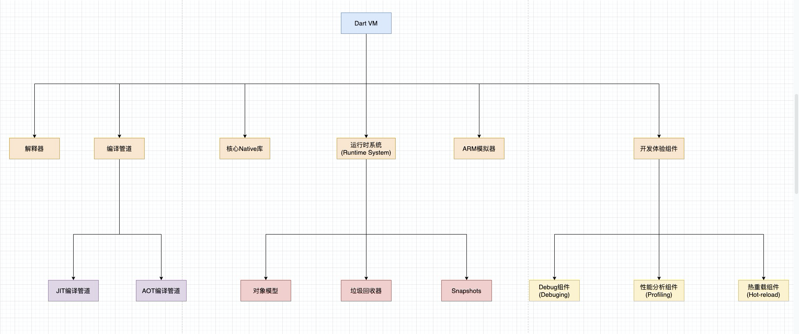

# 学习 Dart 入门实践

## Dart 虚拟机运行原理

Dart VM 是一种为 Dart 语言提供执行环境虚拟机。 Dart VM 既可以支持 JIT（Just in time），边解释执行边编译的编译模式；同时也支持 AOT（Ahead of time），管道将 Dart 源码直接编译成机器码的编译模式。然后运行在预编译运行时（precompiled runtime）环境，但是这种环境不包含任何编译器，所以无法在这种模式动态加载 Dart 源代码。

Dart 虚拟机是用于 Native 原生执行 Dart 代码的组件集合，它主要包含以下内容：

1. 运行时系统（Runtime System）
   对象模型（Object Model）
   垃圾回收器（Garbage Collection）
   快照存储（Snapshots）
2. 核心库 Native 原生方法（Core libraries native methods）
3. 通过服务协议访问的开发体验组件
   Debug 调试工具（Debuging）
   性能分析工具（Profiling）
   热重载工具（Hot-reload）
4. JIT（Just-in-Time）和 AOT（Ahead-of-Time）编译管道
5. 解释器（Interperter）
6. ARM 模拟器（ARM simulators）
